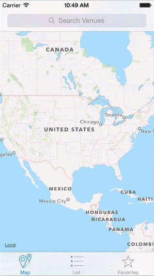

Venue Map Search App
===================

Chris D'Angelo  
cd2665@columbia.edu  
3/22/14
Cellular Networks & Mobile Computing  
Assignment 3 (iOS Part 2)

Demo
====

Description
==========

A simplified google map search app. View results in map view or list view sorted by distance from current location. 
See limited detail on each venue. Save favorite venues found for viewing offline in alphabetical order.
You can remove favorites from the favorites list.

Sources
=======

Apple Documentation Samples:  
* CurrentAddress  
* GeocoderDemo  
* LocateMe  
* MapCallouts  
* MapSearch  
* PhotosByLocation  

Stanford cs193p Fall 2013 Course Example:  
* [Photomania Map](http://www.stanford.edu/class/cs193p/cgi-bin/drupal/downloads-2013-winter)
    
Google Places API Framework:  
* [COMSMapManager](https://github.com/williamFalcon/6998GoogleMapsFramework)

Star rating font from [Font Awesome](http://fortawesome.github.io/Font-Awesome/).

Icons by [PixelLove](http://www.pixellove.com).

To Do
=====

1.  Keyword search is not robust but allows for multiword keyword search.
2.  Currently redrawing map in order to refresh annotations.
